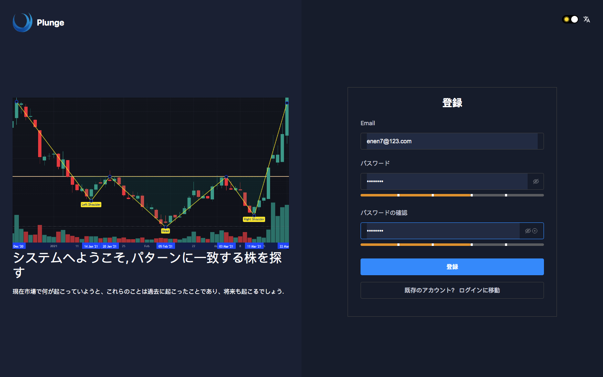
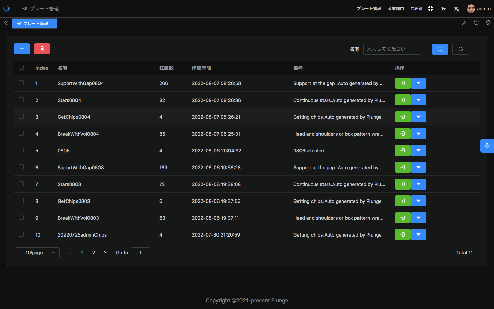
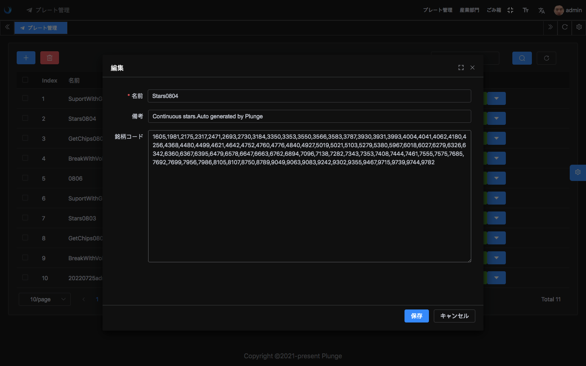
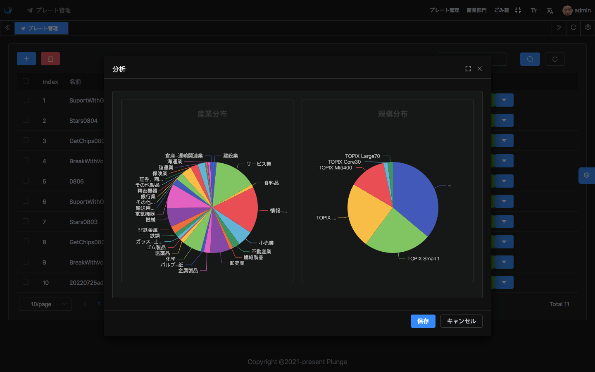
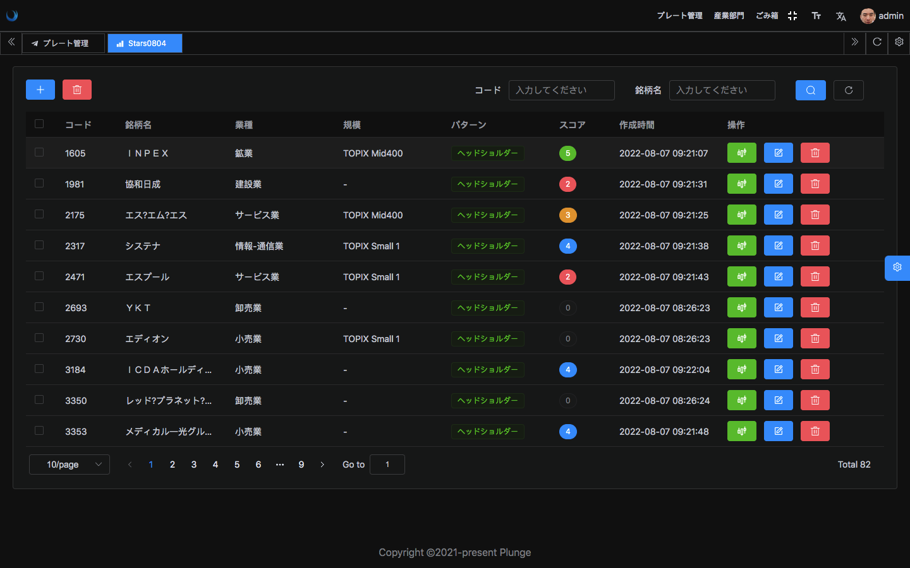
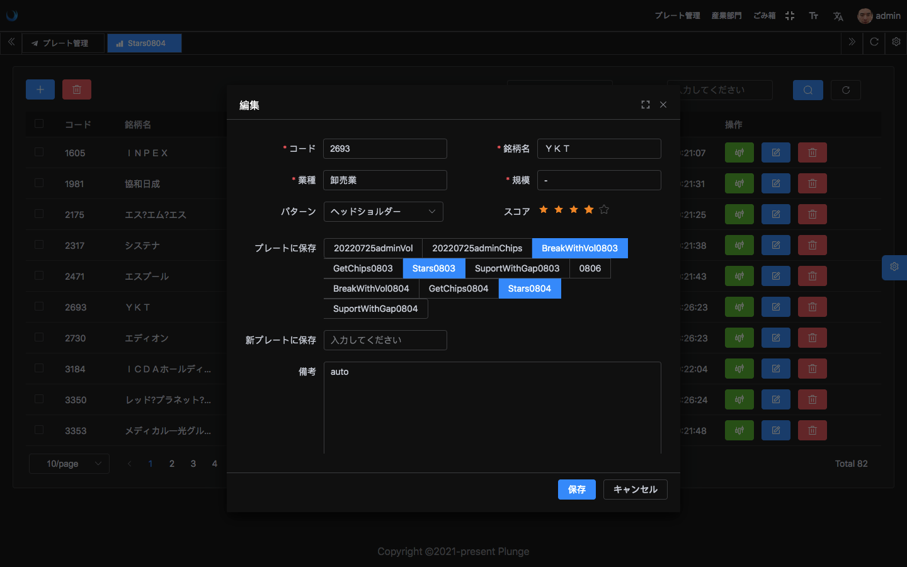
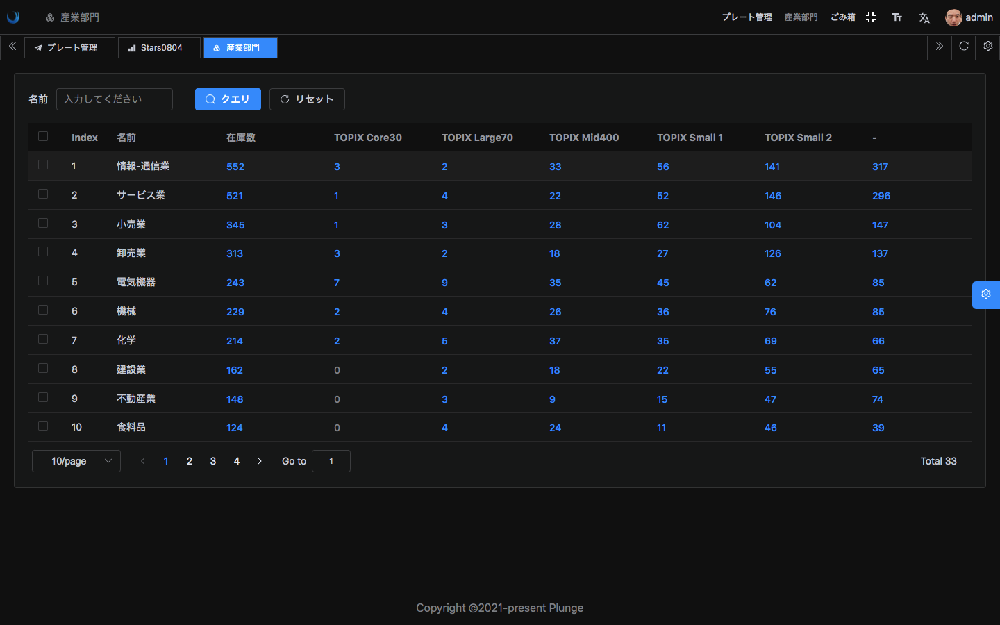
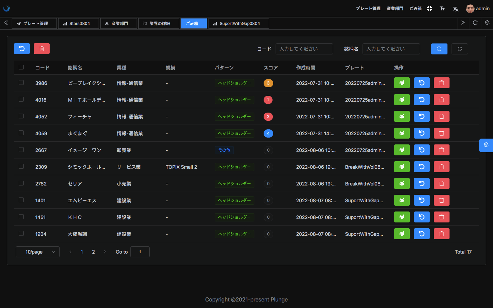

<div align="center"> <a href="https://github.com/kailong321200875/vue-element-plus-admin">  </a> <br> <br>

[](LICENSE)

<h1>Plunge_UI</h1>
</div>

**日本語** | [中文](./README.zh-CN.md)
## 紹介

Plunge_UIはPlungeプロジェクトの先端工程であり、現在は日本の株式市場をサポートしている。に基づく[element-plus-admin](https://element-plus-admin.cn/）開発

## プロパティ

- **プレート管理**：特定の株式をプレートに構成し、プレートのコピーをサポート
- **業界/規模分布**：市場内/プレート内の株式の業界/規模分布を表示できます。
- **株式スコア**：プレート内の株式を表示してスコアを付けることができ、フォローアップに便利である。
- **国際化**：中国語、日本語、英語をサポート
- **最新技術スタック**：TypeScript、Vue 3/vite 2などのフロントエンド技術を使用して開発


## 関連プロジェクト
[Plunge](https://github.com/Harvey-Specter/plunge) :  データ収集と処理,plunge_Apiにデータを提供する
[Plunge_API](https://github.com/Harvey-Specter/plunge_api) : フロントエンドにRestAPIサービスを提供

## プレビュー

<div align="center">
<figure>
   
   






</figure>
</div>


- [plunge](#) -  完全版サイト（建設中）

アカウント：**test/test test/test**

## 開発準備

- [node](http://nodejs.org/) 和 [git](https://git-scm.com/) - プロジェクト開発環境
- [Vite](https://vitejs.dev/) - viteの特性を熟知する
- [Vue3](https://v3.vuejs.org/) - Vueの基本文法に詳しい
- [TypeScript](https://www.typescriptlang.org/) - ` TypeScript `の基本文法を熟知する
- [Es6+](http://es6.ruanyifeng.com/) - es 6の基本文法に詳しい
- [Vue-Router-Next](https://next.router.vuejs.org/) - vue-routerの基本的な使用方法に詳しい
- [Element-Plus](https://element-plus.org/) - element-plusの基本的な使用方法

## インストールと使用

- コードの取得

```bash
git clone https://github.com/Harvey-Specter/plunge_ui.git
checkout plunge
```

- インストール依存

```bash
cd plunge_ui

pnpm install

```

- うんてん

```bash
pnpm run dev
```

- パッケージ化

```bash
pnpm run build:pro
```

## ブラウザのサポート

ローカル開発の推奨使用` Chrome 80+`ブラウザ

現代ブラウザをサポートし、IEをサポートしない

| [](http://godban.github.io/browsers-support-badges/)</br>IE | [](http://godban.github.io/browsers-support-badges/)</br>Edge | [](http://godban.github.io/browsers-support-badges/)</br>Firefox | [](http://godban.github.io/browsers-support-badges/)</br>Chrome | [](http://godban.github.io/browsers-support-badges/)</br>Safari |
| :-: | :-: | :-: | :-: | :-: |
| not support | last 2 versions | last 2 versions | last 2 versions | last 2 versions |

## Lic

[MIT](./LICENSE)

<!-- readme: contributors -end -->
