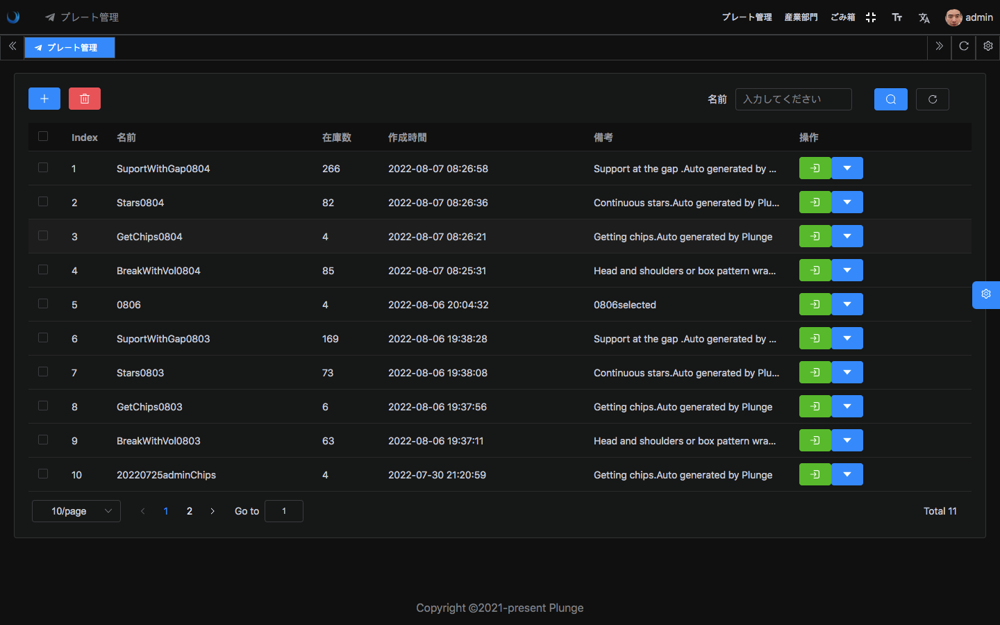
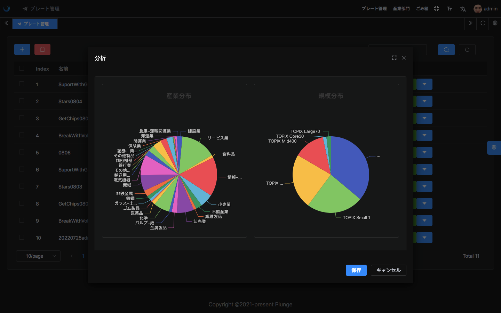
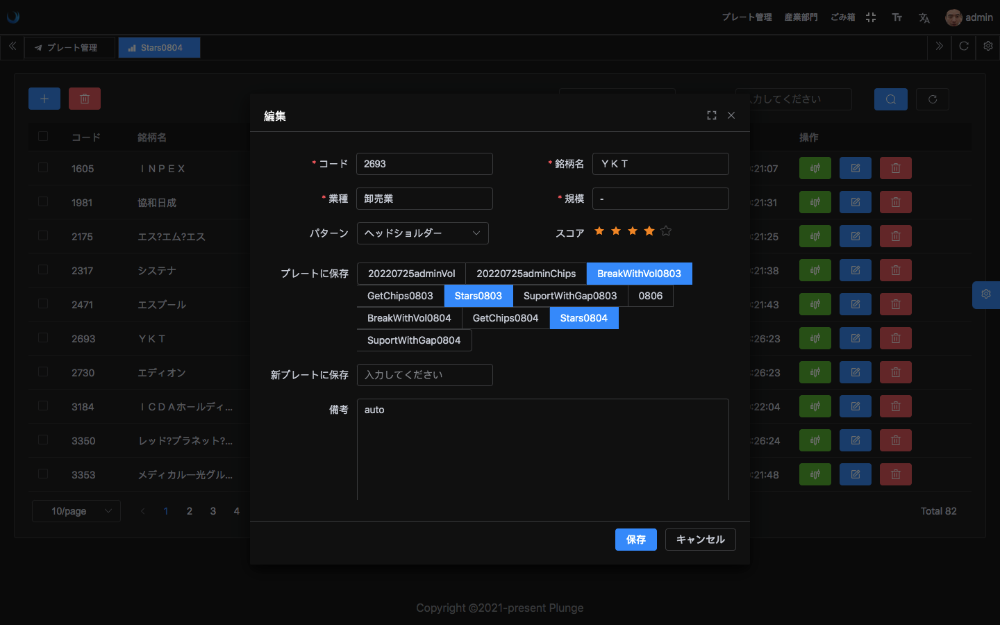

<div align="center"> <a href="https://github.com/kailong321200875/vue-element-plus-admin">  </a> <br> <br>

[](LICENSE)

<h1>Plunge_UI</h1>
</div>

[English](./README.md) | **中文**

## 介绍

Plunge_UI是Plunge项目的前端工程 ,目前只支持了日本股市的行情分析功能,基于 [element-plus-admin](https://element-plus-admin.cn/) 开发

## 特性

- **板块管理**：将特定股票组成板块,支持板块的复制
- **行业/规模分布**：可以查看市场中/板块中股票的行业/规模分布.
- **股票评分**：可以查看板块中股票进行评分,方便后续跟踪.
- **国际化**：目前支持中文,日文和英文
- **最新技术栈**：使用 Vue3/vite2 等前端前沿技术开发
- **TypeScript**: 应用程序级 JavaScript 的语言

## 相关工程
[Plunge](https://github.com/Harvey-Specter/plunge) :  数据采集和处理   
[Plunge_API](https://github.com/Harvey-Specter/plunge_api) : 为前端提供RestAPI服务
## 预览

<div align="center">
   
   






</div>

- [plunge](#) -  完整版站点

帐号：**test/test test/test**

## 开发准备

- [node](http://nodejs.org/) 和 [git](https://git-scm.com/) - 项目开发环境
- [Vite](https://vitejs.dev/) - 熟悉 vite 特性
- [Vue3](https://v3.vuejs.org/) - 熟悉 Vue 基础语法
- [TypeScript](https://www.typescriptlang.org/) - 熟悉 `TypeScript` 基本语法
- [Es6+](http://es6.ruanyifeng.com/) - 熟悉 es6 基本语法
- [Vue-Router-Next](https://next.router.vuejs.org/) - 熟悉 vue-router 基本使用
- [Element-Plus](https://element-plus.org/) - element-plus 基本使用

## 安装和使用

- 获取代码

```bash
git clone https://github.com/Harvey-Specter/plunge_ui.git
checkout plunge
```

- 安装依赖

```bash
cd plunge_ui

pnpm install

```

- 运行

```bash
pnpm run dev
```

- 打包

```bash
pnpm run build:pro
```

## 浏览器支持

本地开发推荐使用 `Chrome 80+` 浏览器

支持现代浏览器, 不支持 IE

| [](http://godban.github.io/browsers-support-badges/)</br>IE | [](http://godban.github.io/browsers-support-badges/)</br>Edge | [](http://godban.github.io/browsers-support-badges/)</br>Firefox | [](http://godban.github.io/browsers-support-badges/)</br>Chrome | [](http://godban.github.io/browsers-support-badges/)</br>Safari |
| :-: | :-: | :-: | :-: | :-: |
| not support | last 2 versions | last 2 versions | last 2 versions | last 2 versions |

## 许可证

[MIT](./LICENSE)

<!-- readme: contributors -end -->
